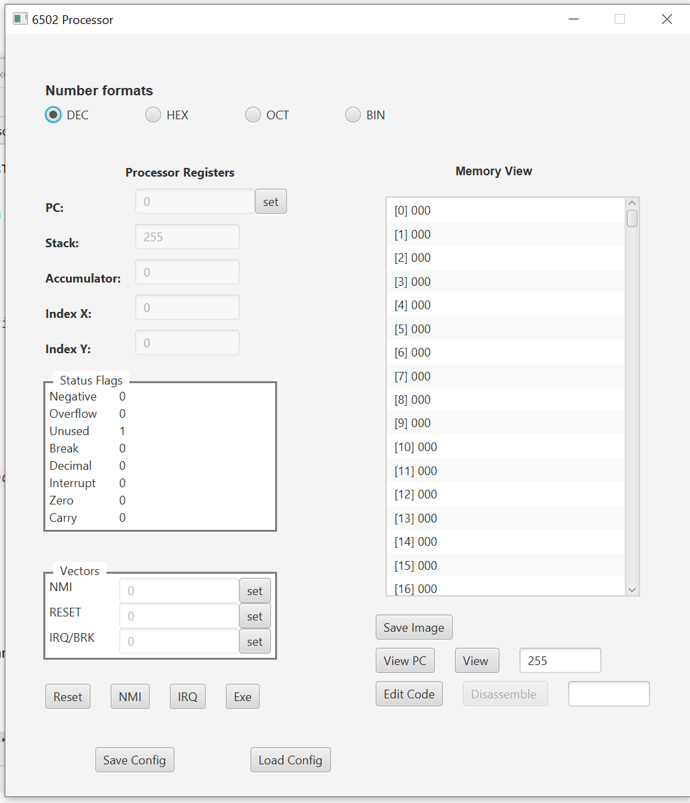

# Processor6502

Scala 3 using JDK 11 and ScalaFX.

**Edit Code**
A simple code edit popup using 6502 nememics and assembler command.

##Assembler Commands

BYT - define a byte value decimal or hex. Can define more than one seperated by commas.

WRD - define a word value decimal or hex. Can define more than one seperated by commas.

ADDR - define an address value (little endian) decimal or hex. Can define more than one seperated by commas.

ORIG - set assembly location.

DEF - define a value decimal or hex

CLR - clear all defined labels etc. Only valid as first line.

symbolname: - a symbolic reference (label) to the current location

##Main Screen

