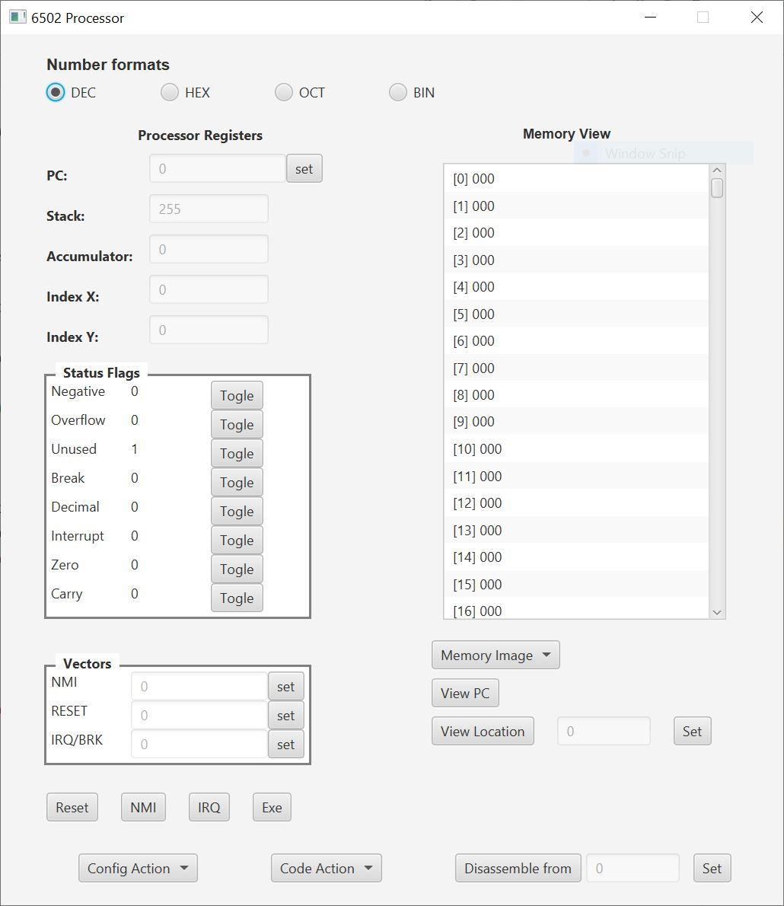
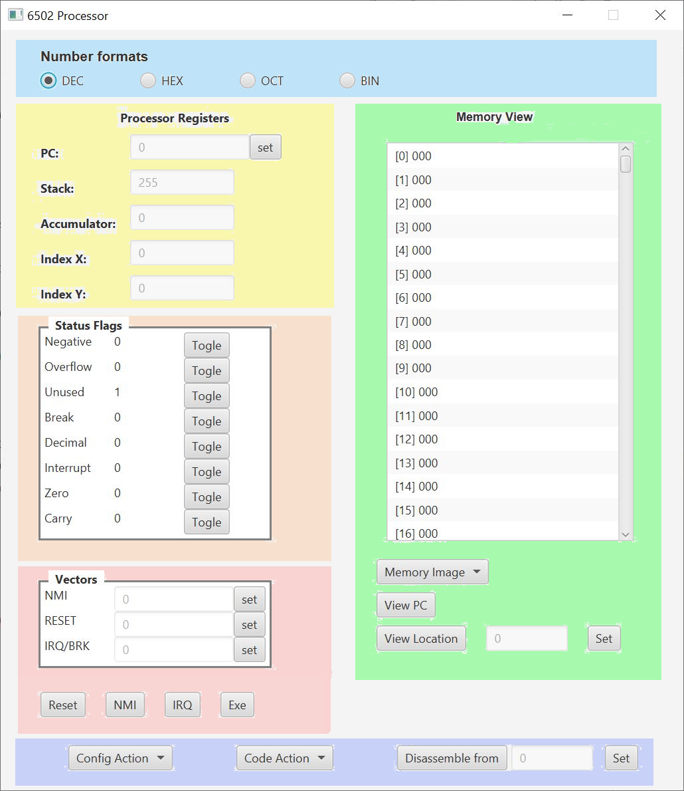

# Processor6502

Scala 3 using JDK 11 and ScalaFX.

Not sure how to characterise this. Its not an emulator or a simulator as it only performs the functions of a 6502 opcode within the environment of the GUI.

##Features
* Built in code editor
  * 6502 nememics 
  * assembler commands.
* Assemble code to memory form editor or file.
* Save and load memory image.
* 3 modes to 'run' code
  * Run - as fast as your machine will go!
  * Run Slow - 50ms delay after each instruction
  * Single step

##Assembler Commands

BYT - define a byte value decimal or hex. Can define more than one seperated by commas.

WRD - define a word value decimal or hex. Can define more than one seperated by commas.

ADDR - define an address value (little endian) decimal or hex. Can define more than one seperated by commas.

ORIG - set assembly location.

DEF - define a value decimal or hex

CLR - clear all defined labels etc. Only valid as first line.

symbolname: - a symbolic reference (label) to the current location

## Main Screen

The main screen

## Main Screen Areas

### Number format 

Select the format in which numbers are displayed for registers and memory

### Processor Registers 

Displays the current contens of the registers.
Clicking the set button for the PC sets th evalue of the programe counter to the entered value.

### Status Flags 

Displays the curent state of the staus register flags.

Each flag has a toggle button which toggles the flag between it 2 possible states.

This enables for example a loop to be terminated during debugging by updating the approprite flags.

### Vectors 

The 6502 vectors are the last 6 bytes of memory.
Each vector can be set using its set button or in assemple as in this example:

    def reset $FFFC
    orig 512
    start:
    ; your code here
    ...
    orig reset
    addr start

The **Reset**, **NMI** and **IRQ** buttons perform the associated interrupt action. The **Exe** button pops up the execute window enabling run or single step.

### Memory View 

Displays the contents of all 65536 memory locations with disasembly of contents if valid.

**Save Image** button saves the current contents of memory to an image file.

The **View PC** button scrolls the view to the current PC location.

The **View** button scrolls the view to the location entered. The loaction is displaye din the associated field in the format selected (DEC, HEX, OCT or BIN) and set by clicking the set button which pops up an input form.

### Actions Area 

**Config Actions** menu button.
* Load - Load a confoguration from a save file
* Save - save current configuration to a save file

**Code Actions** menu button.
* Open Editor - opens the code editor
* Assemble from file - assembles a file without loading into the editor.
* Disassemble from location - disassembles instruction from the given location.

***Disassemble Location***
Displayed in the format selected (DEC, HEX, OCT or BIN) and set by clicking the set button which pops up an input form.